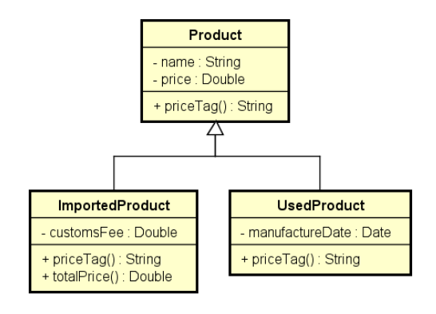
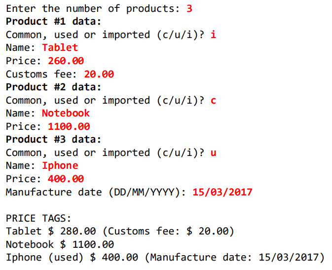

# Herança e Polimorfismo C#
Exercicio resolvido sobre heranca e polimorfismo

## Conceito de Polimorfismo
Em Programação Orientada a Objetos, polimorfismo é recurso que permite
que variáveis de um mesmo tipo mais genérico possam apontar para objetos de tipos específicos diferentes, tendo assim comportamentos diferentes
conforme cada tipo específico.

## Proposta
Fazer um programa para ler os dados de N
produtos (N fornecido pelo usuário). Ao final,
mostrar a etiqueta de preço de cada produto na
mesma ordem em que foram digitados.

Todo produto possui nome e preço. Produtos
importados possuem uma taxa de alfândega, e
produtos usados possuem data de fabricação.
Estes dados específicos devem ser
acrescentados na etiqueta de preço conforme
exemplo (próxima página). Para produtos
importados, a taxa e alfândega deve ser
acrescentada ao preço final do produto.
Favor implementar o programa conforme
projeto:

## Saída esperada

